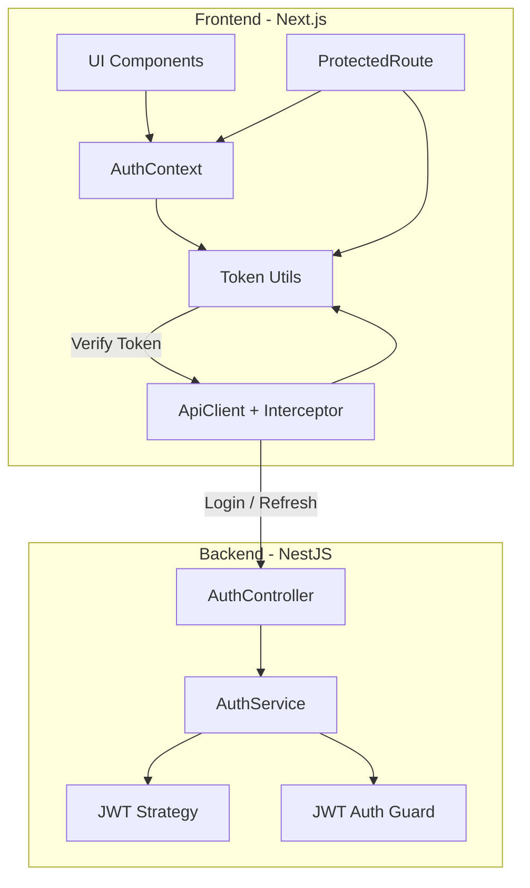
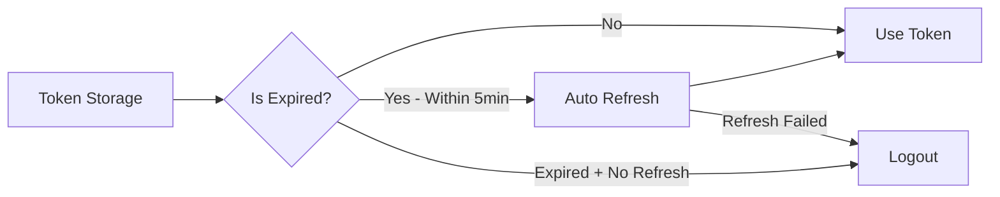

# Arquitectura Profesional de Autenticación JWT

## 📋 Análisis del Estado Actual

### ✅ Lo que funciona bien
1. **Backend (NestJS)**:
   - [`auth.service.ts`](apps/api/src/auth/auth.service.ts): Genera tokens con expiración correcta
   - [`jwt.strategy.ts`](apps/api/src/auth/jwt.strategy.ts): Valida tokens correctamente
   - Endpoint de `/auth/refresh` funcionando

2. **Frontend (Next.js)**:
   - [`api.ts`](apps/web/lib/api.ts): Maneja 401 con refresh automático
   - [`auth-context.tsx`](apps/web/lib/auth-context.tsx): Estado global de auth
   - [`login/page.tsx`](apps/web/app/(auth)/login/page.tsx): Login funcional

### ❌ Problemas Identificados

| Problema | Ubicación | Impacto |
|----------|-----------|---------|
| ProtectedRoute no valida expiración | [`protected-route.tsx`](apps/web/components/auth/protected-route.tsx:20) | Token expirado pasa como válido |
| AuthContext no valida token al bootstrap | [`auth-context.tsx`](apps/web/lib/auth-context.tsx:98) | Token expirado se restaura sin verificar |
| No hay validación proactiva | - | Refresh solo ocurre tras error 401 |
| Logs de debug excesivos | Varios archivos | Contaminación de consola |

---

## 🏗️ Arquitectura Propuesta



---

## 🔐 Flujo de Autenticación

```mermaid
sequenceDiagram
    participant U as Usuario
    participant P as ProtectedRoute
    participant AC as AuthContext
    participant T as TokenUtils
    participant API as ApiClient
    participant B as Backend

    U->>AC: Login(email, password)
    AC->>API: POST /auth/login
    API->>B: JWT credentials
    B->>B: Validate user
    B-->>AC: {accessToken, refreshToken}
    AC->>AC: Save to localStorage
    AC->>U: Authenticated ✓

    Note over U, AC: Session Active
    AC->>T: Check token expiration
    alt Token expiring soon < 5min
        T->>AC: Trigger refresh
        AC->>API: POST /auth/refresh
        API->>B: refreshToken
        B-->>API: New tokens
        API->>AC: Update tokens
    end

    Note over U, P: Page Navigation
    P->>T: Validate token
    alt Token valid
        T-->>P: ✓ Valid
        P->>U: Show protected content
    else Token expired
        T-->>P: ✗ Expired
        P->>AC: Trigger refresh
        alt Refresh success
            AC-->>P: New token
            P->>U: Show protected content
        else Refresh failed
            AC->>U: Redirect to /login
    end
```

---

## 📁 Archivos a Modificar

### 1. Nuevo: [`apps/web/lib/token-utils.ts`](apps/web/lib/token-utils.ts)
Utilidad para decodificar y validar tokens JWT.

```typescript
interface TokenPayload {
  sub: string;
  role: string;
  yachtIds: string[];
  exp: number;
  iat: number;
}

export function decodeToken(token: string): TokenPayload | null {
  try {
    const base64Url = token.split('.')[1];
    const base64 = base64Url.replace(/-/g, '+').replace(/_/g, '/');
    const jsonPayload = decodeURIComponent(
      atob(base64).split('').map(c => '%' + ('00' + c.charCodeAt(0).toString(16)).slice(-2)).join('')
    );
    return JSON.parse(jsonPayload);
  } catch {
    return null;
  }
}

export function isTokenExpired(token: string, bufferMinutes: number = 5): boolean {
  const payload = decodeToken(token);
  if (!payload) return true;
  
  const now = Math.floor(Date.now() / 1000);
  const expiresAt = payload.exp;
  
  // Considerar expirado si ya pasó el tiempo + buffer
  return now >= (expiresAt - bufferMinutes * 60);
}

export function getTokenExpirationDate(token: string): Date | null {
  const payload = decodeToken(token);
  if (!payload) return null;
  return new Date(payload.exp * 1000);
}
```

### 2. Modificar: [`apps/web/lib/auth-context.tsx`](apps/web/lib/auth-context.tsx)
Agregar validación proactiva de token.

**Cambios:**
- En `useEffect` de bootstrap: verificar si token está expirado
- Agregar `isAuthenticated` computed property
- Agregar `checkAuthStatus()` para verificar manually

### 3. Modificar: [`apps/web/components/auth/protected-route.tsx`](apps/web/components/auth/protected-route.tsx)
Mejorar validación con verificación de expiración.

**Cambios:**
```typescript
useEffect(() => {
  if (isLoading) return;

  // 1. Verificar si hay token
  if (!token) {
    router.replace('/login');
    return;
  }

  // 2. Verificar si token está expirado
  if (isTokenExpired(token)) {
    // Intentar refresh antes de redirigir
    refresh().then((success) => {
      if (!success) {
        router.replace('/login');
      }
    });
    return;
  }

  // Token válido
  initialized.current = true;
}, [token, isLoading, router, refresh]);
```

### 4. Nuevo: [`apps/api/src/auth/auth.controller.ts`](apps/api/src/auth/auth.controller.ts)
Agregar endpoint de verificación de token.

```typescript
@Get('verify')
@UseGuards(JwtAuthGuard)
async verify(@CurrentUser() user: Express.User) {
  return { 
    valid: true, 
    userId: user.userId,
    role: user.role,
  };
}
```

### 5. Cleanup: Remover logs de debug
- [`auth-context.tsx`](apps/web/lib/auth-context.tsx) - ~12 console.log
- [`protected-route.tsx`](apps/web/components/auth/protected-route.tsx) - ~4 console.log
- [`login/page.tsx`](apps/web/app/(auth)/login/page.tsx) - ~8 console.log

---

## ⏱️ Tiempos de Expiración (Configurados)

| Token | Expiración | Uso |
|-------|------------|-----|
| Access Token | 15 minutos | Requests API |
| Refresh Token | 7 días | Renovar access token |
| Buffer Refresh | 5 minutos antes | Refresh proactivo |

---

## 🔄 Flujo de Refresh Automático



---

## ✅ Checklist de Implementación

### Backend
- [ ] Verificar configuración de JWT en `.env`
- [ ] Agregar endpoint `GET /auth/verify`
- [ ] Revisar `ignoreExpiration: false` en JWT Strategy

### Frontend
- [ ] Crear [`token-utils.ts`](apps/web/lib/token-utils.ts)
- [ ] Modificar [`auth-context.tsx`](apps/web/lib/auth-context.tsx)
- [ ] Modificar [`protected-route.tsx`](apps/web/components/auth/protected-route.tsx)
- [ ] Agregar refresh proactivo en AuthContext
- [ ] Limpiar todos los console.log de debug
- [ ] Testear flujo completo: login → protected route → refresh → logout

---

## 🧪 Testing del Flujo

```bash
# 1. Login exitoso
POST /api/auth/login
Body: { email: "admin@yachtpms.com", password: "..." }
Response: { accessToken, refreshToken }

# 2. Access protected route
GET /api/protected
Header: Authorization: Bearer <accessToken>
Response: 200 OK

# 3. Token expirado (después de 15min)
GET /api/protected
Response: 401 Unauthorized

# 4. Refresh token
POST /api/auth/refresh
Body: { refreshToken: "..." }
Response: { accessToken, refreshToken }

# 5. Verify token
GET /api/auth/verify
Header: Authorization: Bearer <accessToken>
Response: { valid: true, userId, role }
```
